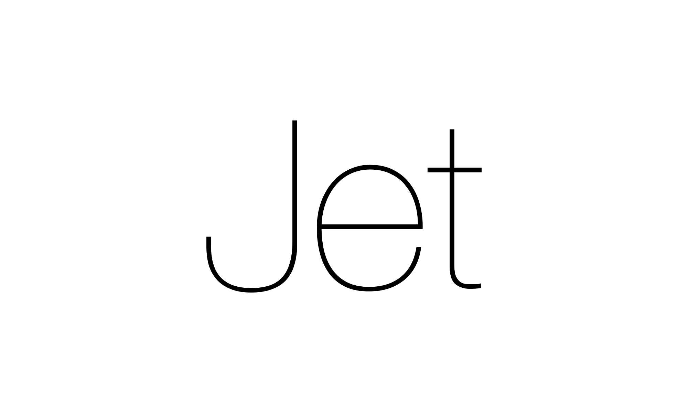

> Acorn is a elegant, minimalistic, high-level programming language implemented
> in C++ with LLVM. It borrows ideas from MATLAB, Julia, Python, Ruby and many
> other languages. It supports features such as multiple-dispatch, operating
> overloading, static typesystem with inference and concurrency.

## What does it look like?

```ruby
def hello
  print("Hello, world!")
end

hello()
```

## How to build?

```bash
$ cmake --build build --config Debug
```

## How to use?

```bash
$ ./build/src/acornc test.acorn
$ ./test
```
